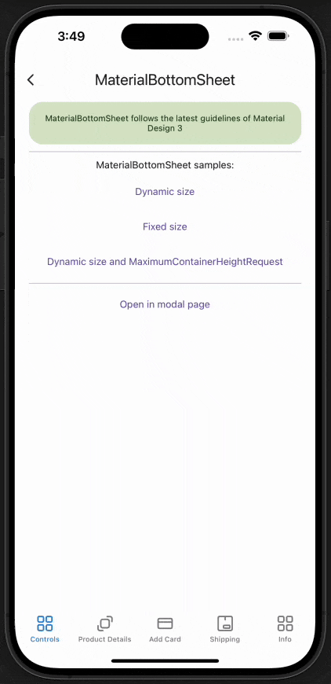

# MaterialBottomSheet
MaterialBottomSheet shows secondary content anchored to the bottom of the screen.
<br/>
[View Material Design documentation](https://m3.material.io/components/bottom-sheets/overview)

## Screenshot


## Example
```XML
<material3:MaterialBottomSheet
    x:Name="materialBottomSheet">
    <material3:MaterialBottomSheet.Content>
        <StackLayout>
            <material3:MaterialLabel
                Text="Secondary content anchored to the bottom of the screen" />
        </StackLayout>
    </material3:MaterialBottomSheet.Content>
</material3:MaterialBottomSheet>
```

## Documentation

### Method Open:
Method used to open/show the bottom sheet.
```C#
await materialBottomSheet.Open();          
```
<br/>

### Method Close:
Method used to close/hide the bottom sheet.
```C#
await materialBottomSheet.Close();          
```
<br/>

### Property BackgroundColor:
Gets or sets the container background color.
<br/>

### Property CornerRadius:
Gets or sets the container corner radius.
<br/>

### Property Content:
Gets or sets the content that will be displayed inside the container.
<br/>

### Property ContentVerticalOptions:
Gets or sets the vertical options to the container's content. By default it has the **Start** value.
<br/>

### Property ContainerHeight:
Gets or sets the container height. By default it has a **-1** and the height of the container adjusts to the container's content. This property should only be used if a fixed height is needed for the container.
<br/>

### Property ContainerRelativeHeight:
Gets or sets the relative (proportional) container height. By default it has a **-1** and this property is not taken into account. This property should only be used if a relative (proportional) fixed height is needed for the container. This property allows values between 0 and 1.
<br/>

### Property MaximumContainerHeightRequest:
Gets or sets the maximum height to which the container can expand. It only works when the ContainerHeight property is not set and the container height is dynamic.
<br/>

### Property IsOpened:
Gets a boolean that indicates whether the container is open or not. It is a read-only binding property.
<br/>

### Property ScrimColor:
Gets or sets the scrim color.
<br/>

### Property ScrimOpacity:
Gets or sets the scrim opacity/transparency.
<br/>

### Property DragHandleColor:
Gets or sets the drag handle color.
<br/>

### Property DragHandleWidth:
Gets or sets the drag handle width.
<br/>

### Property DragHandleHeight:
Gets or sets the drag handle height.
<br/>

### Property DragHandleIsVisible:
Gets or sets if the the drag handle is visible.
<br/>

### Property AnimationDuration:
Gets or sets the amount of time in milliseconds that will be used to animate the container when it is opening or closing.
<br/>

### Property DismissThreshold:
Gets or sets the threshold point where the container will be dismissed if the user is swiping to hide it. This property accepts values between 0 and 1. By default it has a **0.4**.
<br/>

### Property IsSwipeEnabled:
Gets or sets if the user will be able to swipe the container to dismiss/hide it.
<br/>

### Property DismissWhenScrimIsTapped:
Gets or sets if the user will be able to tap over the scrim to dismiss/hide the container.
<br/>

## Best Practices and Considerations

> ⚠️ Avoid utilizing the **Margin** property within the root element of the MaterialBottomSheet's content, as its usage may result in errors or unexpected behaviors.  

> ⚠️ If the MaterialBottomSheet will be used within a tabbed view (TabbedPage), setting a BackgroundColor for the TabBar is advisable, as it may cause unexpected behaviors on iOS.
Example of how to set the BackgroundColor of the TabBar:
UITabBar.Appearance.BackgroundColor = UIColor.White;  
