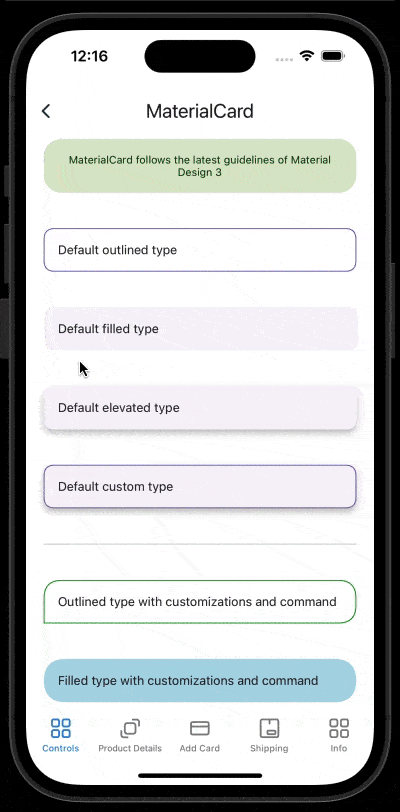

# MaterialCard
MaterialCard display content and actions about a single subject.
<br/>
[View Material Design documentation](https://m3.material.io/components/cards/overview)

## Screenshot


## Example
```XML
<material3:MaterialCard
    Type="Elevated"
    CornerRadius="16,16,0,16">
    <material3:MaterialLabel
        Text="Elevated type card" />
</material3:MaterialCard>
```

## Documentation
### Property Type:
Gets or sets card type.
#### Allowed values
- Elevated
- Filled (Default)
- Outlined
- Custom
<br/>

### Property BackgroundColor:
Gets or sets card background color.
<br/>

### Property Command:
Gets or sets a Command to be executed when card is tapped.
<br/>

### Property CommandParameter:
Gets or sets a parameter to be passed to command when card is tapped.
<br/>

### Property IsEnabled:
Indicates if card is enabled or not.
<br/>

### Property Animation:
Gets or sets animation to be executed when card is tapped.
#### Allowed values
- None
- Fade (Default)
- Scale
- Custom
<br/>

### Property AnimationParameter:
Gets or sets a parameter to be passed to animation when card is tapped.
<br/>

### Property CustomAnimation:
Gets or sets a custom animation to be executed when card is tapped.
<br/>

### Property HasShadow:
Gets or sets if card has shadow. Applies only to ```Custom``` type.
<br/>

### Property ShadowColor:
Gets or sets shadow color. Applies only to ```Custom``` or ```Elevated``` type.
<br/>

### Property HasBorder:
Indicates if card has border. Applies only to ```Custom``` or ```Outlined``` type.
<br/>

### Property BorderColor:
Gets or sets border color. Applies only to ```Custom``` or ```Outlined``` type.
<br/>

### Property BorderWidth:
Gets or sets border width. Applies only to ```Custom``` or ```Outlined``` type.
<br/>

### Property CornerRadius:
Gets or sets corner radius. Can be set as uniform radius value (ie. ```8```) or individual radius values ```(topLeft, topRight, bottomLeft, bottomRight)``` (ie. ```8,8,0,0``` for upper rounded corners and lower plain ones).
<br/>

## Platform Specifics
### iOS
### Property iOSShadowRadius:
Gets or sets radius value for shadow. Applies only to ```Custom``` or ```Elevated``` type.
<br/>

### Property iOSShadowOpacity:
Gets or sets shadow opacity. Applies only to ```Custom``` or ```Elevated``` type.
<br/>

### Property iOSShadowOffset:
Gets or sets shadow offset ```(width, height)``` . Applies only to ```Custom``` or ```Elevated``` type.
<br/>

### Android
### Property AndroidElevation:
Gets or sets shadow elevation. Applies only to ```Custom``` or ```Elevated``` type.
<br/>