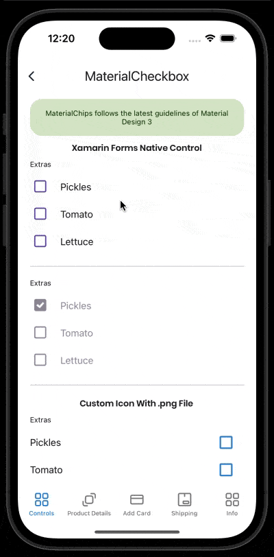

# MaterialCheckbox
This control is a custom implementation of a Checkbox. You can customize some properties that we show in Documentation topic. 
<br/>
[View Material Design documentation](https://m3.material.io/components/checkbox/overview)

## Screenshot


## Example
```XML
 <material3:MaterialCheckbox 
    Text="Pickles"
    SelectedIcon="checked.png"
    UnselectedIcon="unchecked.png"
    DisabledSelectedIcon="disabledChecked.png"
    DisabledUnselectedIcon="disabledUnchecked.png"
    Animation="Scale" />
```
<br/>

## Documentation

### Event IsCheckedChanged:
Event fired when checkbox value changes.
<br/>

### Property Text:
This property is to set the text value.
<br/>

### Property TextColor:
This property is to set the color of the text when the control is enabled.
<br/>

### Property DisabledTextColor:
This property is to set the color of the text when the control is disabled.
<br/>

### Property FontSize:
This property is to set the fontsize of the text.
<br/>

### Property FontFamily:
This propperty is to set the fontfamily of the text.
<br/>

### Property SupportingText:
This property is to set the error text on the control. 
<br/>

### Property SupportingTextColor:
This property is to set the error text color value on the control.
<br/>

### Property SupportingSize:
This property is to set the error text font size value on the control. 
<br/>

### Property SupportingFontFamily:
This property is to set the error text font family value on the control.
<br/>

### Property SupportingMargin:
This property is to set the error text margin value on the control.
<br/>

### Property AnimateError:
This property is to set if you can show a ShakeAnimation when there is a error with control.
<br/>

### Property SelectedIcon:
This property is to set the icon with .png when the control is enabled and it is checked.
<br/>

### Property UnselectedIcon:
This property is to set the icon with .png when the control is enabled and it is unchecked.
<br/>

### Property DisabledSelectedIcon:
This property is to set the icon with .png when the control is disabled and it is checked.
<br/>

### Property DisabledUnselectedIcon:
This property is to set the icon with .png when the control is disabled and it is unchecked.
<br/>

### Property CustomSelectedIcon:
This property is to set the icon with .svg when the control is enabled and it is checked.
<br/>

### Property CustomUnselectedIcon:
This property is to set the icon with .svg when the control is enabled and it is unchecked.
<br/>

### Property CustomDisabledSelectedIcon:
This property is to set the icon with .svg when the control is disabled and it is checked.
<br/>

### Property CustomDisabledUnselectedIcon:
This property is to set the icon with .svg when the control is disabled and it is unchecked.
<br/>

### Property IconHeightRequest:
This property is to set the HeightRequest of the icon. By default is 24.
<br/>

### Property IconWidthRequest:
This property is to set the WidthRequest of the icon. By default is 24.
<br/>

### Property TextSide:
This property is to set the side of the text, it could be: Right or Left. By default is Right.
<br/>

### Property TextHorizontalOptions:
This property is to set the HorizontalOptions of the text. By default is Start.
<br/>

### Property SelectionHorizontalOptions:
This property is to set the HorizonatlOptions of the icon. By default is start.
<br/>

### Property Spacing:
This property is to set the space between icon and the text. By default is 10.
<br/>

### Property IsChecked:
This property is to set if the control is checked or not. By default is False.
<br/>

### Property IsEnabled:
This property is to set if the control is enabled or not. By default is True.
<br/>

### Property Animation:
This property is to set the animation of the control: Scale, Fade, None. By default is None.
<br/>

### Property Color:
This property is to set the color of the checkbox when it is enabled. It only applies when the Icon is not set.
<br/>

### Property DisabledColor:
This property is to set the color of the checkbox when it is disabled. It only applies when the Icon is not set.
<br/>

### Property Command:
This property is to bind to viewmodel when it the value changed.
<br/>

### Property CommandParameter:
This property is to send the parameter through Command.
