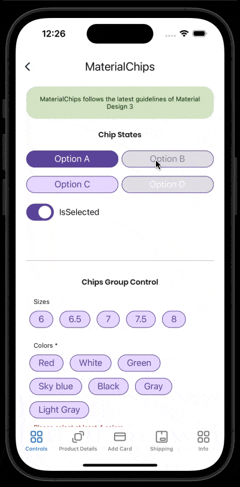

# MaterialChips
Chips are compact elements that represent an input, attribute, or action.
<br/>
[View Material Design documentation](https://m3.material.io/components/chips/overview)

## Screenshot


## Example
```XML
<material3:MaterialChips 
    IsEnabled="true"
    IsSelected="True"
    Text="Option A"
    ToUpper="True"
    TrailingIcon="cancel.png"
    BackgroundColor="LightGray"
    TextColor="Black"
    SelectedBackgroundColor="Red"
    SelectedTextColor="White" />
```

## Documentation

### Property Command
Command for MaterialChips when is selected or pressed.
<br/>

### Property CommandParameter:
Command parameter for MaterialChips when is selected or pressed.
<br/>

### Property IsEnabled:
This property is to set the if the MaterialChips control is enabled.
<br/>

### Property IsSelected:
This property is to set the if the MaterialChips control is selected.
<br/>

### Property Padding:
This property is to set the padding by default is 16 and 0 horizontally and vertically respectly.
<br/>

### Property TextMargin:
This property is to set the TextMargin.
<br/>

### Property BorderColor:
This property is to set the border color.
<br/>

### Property LeadingIcon:
This property is to set the leading icon.
<br/>

### Property CustomLeadingIcon:
This property is to set custom leading icon.
<br/>

### Property LeadingIconIsVisible:
This property is to set if the leading icon is visible.
<br/>

### Property TrailingIcon:
This property is to set the trailing icon.
<br/>

### Property CustomTrailingIcon:
This property is to set custom trailing icon.
<br/>

### Property TrailingIconIsVisible:
This property is to set if the trailing icon is visible.
<br/>

### Property Text:
This property is to set the MaterialChips text.
<br/>

### Property TextColor:
This property is to set the text color.
<br/>

### Property SelectedTextColor:
This property is to set the selected text color.
<br/>

### Property DisabledTextColor:
This property is to set the disabled selected text color.
<br/>

### Property DisabledSelectedTextColor:
This property is to set the disabled selected text color.
<br/>

### Property BackgroundColor:
This property is to set the background color.
<br/>

### Property SelectedBackgroundColor:
This property is to set the selected background color.
<br/>

### Property DisabledBackgroundColor:
This property is to set the disabled background color.
<br/>

### Property DisabledSelectedBackgroundColor:
This property is to set the disabled selected background color.
<br/>

### Property FontSize:
This property is to set the text font size.
<br/>

### Property FontFamily:
This property is to set the text font family.
<br/>

### Property CornerRadius:
This property is to set the corner radious.
<br/>

### Property ToUpper:
This property is to set the if you wanna change the text to upper case.
<br/>

### Property Animation:
This property is to set the if you wanna change animation for chips.
<br/>

### Property AnimationParameter:
This property is to set the if you wanna change animation parameter for chips. By default is 0.7.
<br/>
