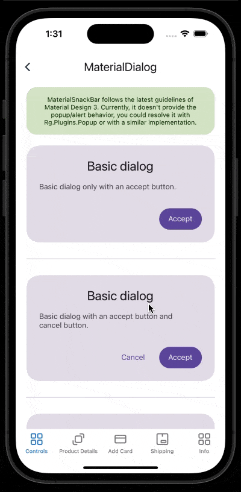

# MaterialDialog
Dialogs provide important prompts in a user flow.
<br/>
Currently, this control only represents the UI and guidelines proposed by Material, it doesn't provide the popup/alert behavior, you could resolve it with Rg.Plugins.Popup or with a similar implementation.
<br/>
[View Material Design documentation](https://m3.material.io/components/dialogs/overview)

## Screenshot


## Example
```XML
<material3:MaterialDialog
    HeadlineText="Basic dialog"
    SupportingText="Basic dialog with an accept button and cancel button."
    AcceptText="Accept"
    AcceptCommand="{Binding AcceptCommand}"
    CancelText="Cancel"
    CancelCommand="{Binding CancelCommand}" />
```

## Documentation

### BackgroundColor:
This property is to set the background color of the dialog.
<br/>

### ShadowColor:
This property is to set the background color of the dialog shadow.
<br/>

### Property HasShadow 
This property is to set if the control will have shadow or not.
<br/>

### Property CornerRadius:
This property is to set the corner radius of the dialog.
<br/>

### Property Icon:
This property is to set the icon with support for PNG, JPG or JPEG.
<br/>

### Property CustomIcon:
This property is to set the leading icon with support for view, you can use SVG, font icon, PNG, JPG or JPEG.
<br/>

### Property IconSize:
This property is to set the sizes to the icon.
<br/>

### Property IconAlignment:
This property is to set the icon alignment.
#### Allowed Values:
- Start
- Center
- End
<br/>

### Property HeadlineText:
This property is to set the headline text of the dialog.
<br/>

### Property HeadlineAlignment:
This property is to set the horizontal headline text alignment.
#### Allowed Values:
- Start
- Center
- End
<br/>

### Property HeadlineColor:
This property is to set the color text of the headline.
<br/>

### Property HeadlineFontSize:
This property is to the font size of the headline.
<br/>

### Property HeadlineFontFamily:
This property is to the font family of the headline.
<br/>

### Property SupportingText:
This property is to set the supporting text of the dialog.
<br/>

### Property SupportingTextAlignment:
This property is to set the horizontal supporting text alignment.
#### Allowed Values:
- Start
- Center
- End
<br/>

### Property SupportingTextColor:
This property is to set the color text of the supporting text.
<br/>

### Property SupportingTextFontSize:
This property is to the font size of the supporting text.
<br/>

### Property SupportingTextFontFamily:
This property is to the font family of the supporting text.
<br/>

### Property ShowDivider:
This property is to set if the control will have divider or not.
<br/>

### Property DividerColor:
This property is to set the color of the divider.
<br/>

### Property CancelText:
This property is to set the text of the cancel button.
<br/>

### Property CancelBackgroundColor:
This property is to set the background color of the cancel button.
<br/>

### Property CancelTextColor:
This property is to set the color text of the cancel button.
<br/>

### Property CancelFontSize:
This property is to the font size of the cancel button.
<br/>

### Property CancelFontFamily:
This property is to the font family of the cancel button.
<br/>

### Property CancelCornerRadius:
This property is to set the corner radius of cancel button.
<br/>

### Property CancelCommand:
This property is to the command of the cancel button.
<br/>

### Property CancelIsBusy:
This property is to show a busy indicator in the cancel button when a command is running.
<br/>

### Property AcceptIsEnabled:
This property is to set if the cancel button is enabled or disabled.
<br/>

### Property AcceptText:
This property is to set the text of the accept button.
<br/>

### Property AcceptBackgroundColor:
This property is to set the background color of the accept button.
<br/>

### Property AcceptTextColor:
This property is to set the color text of the accept button.
<br/>

### Property AcceptFontSize:
This property is to the font size of the accept button.
<br/>

### Property AcceptFontFamily:
This property is to the font family of the accept button.
<br/>

### Property AcceptCornerRadius:
This property is to set the corner radius of accept button.
<br/>

### Property AcceptCommand:
This property is to the command of the accept button.
<br/>

### Property AcceptIsBusy:
This property is to show a busy indicator in the accept button when a command is running.
<br/>

### Property AcceptIsEnabled:
This property is to set if the accept button is enabled or disabled.
<br/>

### Property ButtonsAlignment:
This property is to set the horizontal alignment of the accept and cancel buttons.
#### Allowed Values:
- Start
- Center
- End
<br/>

### Property ShowSearch:
This property is to set if the control will have a search to filter the items or not.
<br/>

### Property SearchPlaceholder:
This property is to set the text of the search placeholder.
<br/>

### Property SearchTextAlignment:
This property is to set the horizontal alignment of the search text.
#### Allowed Values:
- Start
- Center
- End
<br/>

### Property SearchTextColor:
This property is to set the color text of the search text.
<br/>

### Property SearchBackgroundColor:
This property is to set the background color of the search.
<br/>

### Property SearchTextFontSize:
This property is to the font size of the search text.
<br/>

### Property SearchTextFontFamily:
This property is to the font family of the search text.
<br/>

### Property AllowMultiselect:
This property is to set if the control will allow multiple selection of items or not.
<br/>

### Property ItemsSource
This property is for displaying list of items to select. You should set a List of MaterialDialogItem.
Its definition is:
- Id (string): internal identifier that you could need to identify the items.
- Text (string): text showed.
- IsSelected (bool): by default you can select an item or items in case multiple select is allowed.
<br/>
<br/>

### Property ItemTextColor:
This property is to set the color text of the items.
<br/>

### Property ItemTextFontSize:
This property is to the font size of the items.
<br/>

### Property ItemTextFontFamily:
This property is to the font family of the items.
<br/>

### Property ItemCheckboxColor:
This property is to set the checkbox color of the items.
<br/>

### Property ItemCheckboxSelectedIcon
This property is to set the icon when is checked, it supports PNG, JPG or JPEG.
<br/>

### Property ItemCheckboxUnselectedIcon
This property is to set the icon when is unchecked, it supports PNG, JPG or JPEG.
<br/>

### Property ItemCheckboxCustomSelectedIcon
This property is to set the icon when is checked. It is a DataTemplate property, so you can set any control, it could supports SVG, font icon, PNG, JPG or JPEG.
<br/>

### Property ItemCheckboxCustomUnselectedIcon
This property is to set the icon when is unchecked. It is a DataTemplate property, so you can set any control, it could supports SVG, font icon, PNG, JPG or JPEG.
<br/>

### Property ItemCheckboxSize
This property is to set the size of the checkbox.
<br/>

### Property ItemCheckboxSpacing
This property is to set the spacing of the checkbox.
<br/>