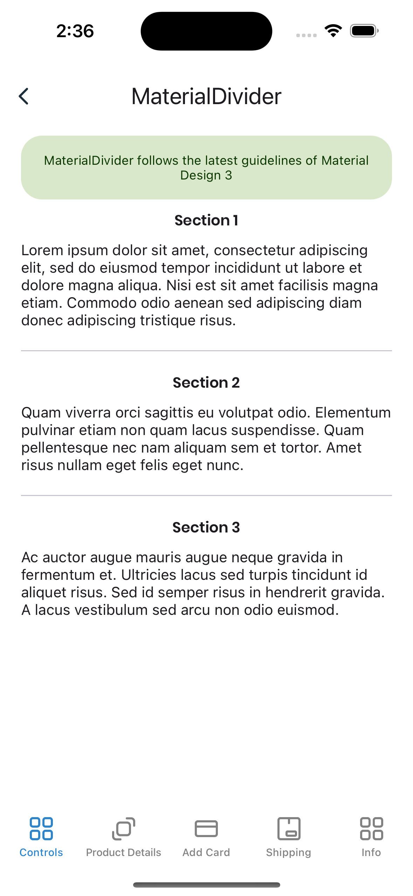

# MaterialDivider
A divider is a thin line that groups content in lists and layouts.
<br/>
[View Material Design documentation](https://m3.material.io/components/divider/overview)

## Screenshot



## Example
```XML
<material3:MaterialDivider />
```

## Documentation
<br/>

### Property Color
This property is to set the divider color.
<br/>
<br/>