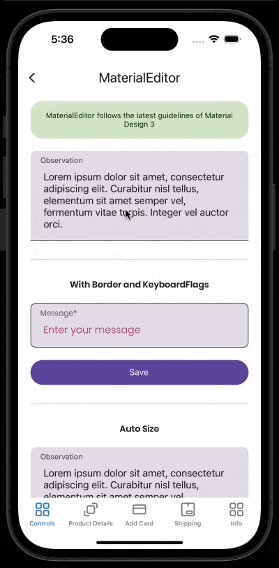

# MaterialEditor
Text fields let users enter and edit text.
<br/>
[View Material Design documentation](https://m3.material.io/components/text-fields/overview)

## Screenshot


## Example
```XML
<material3:MaterialEditor 
    LabelText="Description" 
    Placeholder="Enter your description" 
    LeadingIcon="email.png" 
    HeightRequest="200" />
```

## Documentation

### Property Keyboard
Default keyboard and base class for specialized keyboards, such as those for telephone numbers, email, URLs and others.
#### Allowed Values:
- Plain
- Chat
- Email
- Numeric
- Telephone
- Text
- URL
<br/>
<br/>

### Property KeyboardFlags
Enumerates keyboard option flags that controls capitalization, spellcheck, suggestion behavior and others. 
#### Allowed Values:
- CapitalizeSentence
- Spellcheck
- Suggestions
- CapitalizeWord
- CapitalizeCharacter
- CapitalizeNone
- All
- None
#### Usage Example
- Using only one flag
```XML
<material3:MaterialEditor
    LabelText="Name *"
    Placeholder="Enter your name"
    MaxLength="50"
    KeyboardFlags="CapitalizeWord"
    Text="{Binding Name}"
    SupportingText="Name is required"
    AnimateError="True"
    TabIndex="1"
    SupportingTextColor="Red" />
```
- Using multiple flags
```XML
<material3:MaterialEditor
    LabelText="Name *"
    Placeholder="Enter your name"
    MaxLength="50"
    KeyboardFlags="CapitalizeWord|Suggestions"
    Text="{Binding Name}"
    SupportingText="Name is required"
    AnimateError="True"
    TabIndex="1"
    SupportingTextColor="Red" />
```
<br/>
<br/>

### Property Text:
This property is to set the current text.
<br/>
<br/>

### Property MaxLength:
This property is to set the max length of the text.
<br/>
<br/>

### Property TextChanged:
This property is to set the event after the text changed.
<br/>
<br/>

### Property CornerRadius:
This property is to set the corner radius for the control. This is used only when you set HasBorder as true.

CornerRadius supports a uniform radius to the four corners or you can set a different corner radius for each corner:
- CornerRadius="10"
- CornerRadius="0,10,10,10"
<br/>
<br/>

### Property AnimateError:
This property is to set the if you want or not animate the control on error.
<br/>
<br/>

### Property HorizontalTextAlignment:
This property only set the horizontal text aligment of Label and supporting text.
#### Allowed Values:
- Start
- Center
- End
<br/>
<br/>

### Property TextColor:
This property is to set the text color.
<br/>
<br/>

### Property FocusedTextColor:
This property is to set the focused text color.
<br/>
<br/>

### Property DisabledTextColor:
This property is to set the disabled text color.
<br/>
<br/>

### Property FontSize:
This property is to set the font size.
<br/>
<br/>

### Property FontFamily:
This property is to set the font family.
<br/>
<br/> 

### Property Placeholder:
This property is to set the placeholder.
<br/>
<br/>

### Property PlaceholderColor:
This property is to set the placeholder color.
<br/>
<br/>

### Property AnimatePlaceholder:
If you set this property to true the placeholder will be translated to label place. **you mustn't set Label Text**
<br/>
<br/>

### Property LabelText:
This property is to set the label.
<br/>
<br/>

### Property LabelTextColor:
This property is to set the label color.
<br/>
<br/>

### Property FocusedLabelTextColor:
This property is to set the focused label color.
<br/>
<br/>

### Property DisabledLabelTextColor:
This property is to set the disabled label color.
<br/>
<br/>

### Property LabelSize:
This property is to set the label size.
<br/>
<br/>

### Property LabelFontFamily:
This property is to set the label font family.
<br/>
<br/>

### Property LabelMargin:
This property is to set the label margin family. By default uses (16,0,16,0).
<br/>
<br/>

### Property SupportingText:
This property is to set the supporting text.
<br/>
<br/>

### Property SupportingTextColor:
This property is to set the supporting text color.
<br/>
<br/>

### Property SupportingSize:
This property is to set the supporting text size.
<br/>
<br/>

### Property SupportingFontFamily:
This property is to set the supporting text font family.
<br/>
<br/>

### Property SupportingMargin:
This property is to set the supporting text margin. By default uses (16,4,16,0).
<br/>
<br/>

### Property BorderColor:
This property is to set the border color. This is enabled when you set the property HasBorder equals true.
<br/>
<br/>

### Property FocusedBorderColor:
This property is to set the focused border color. This is enabled when you set the property HasBorder equals true.
<br/>
<br/>

### Property DisabledBorderColor:
This property is to set the border color. This is enabled when you set the property HasBorder equals true.
<br/>
<br/>

### Property HasBorder:
This property is to set if this control has border or not.
<br/>
<br/>

### Property BorderWidth:
This property is to set the border width.
<br/>
<br/>

### Property IndicatorColor:
This property is to set the indicator color.
<br/>
<br/>

### Property CursorColor:
This property is to set the cursor color. **Only supported on iOS**
<br/>
<br/>

### Property BackgroundColor:
This property is to set the background color.
<br/>
<br/>

### Property LeadingIcon:
This property is to set the leading icon. This can be png or jpg.
<br/>
<br/>

### Property CustomLeadingIcon:
This property is to set the leading icon with support to svg.
<br/>
<br/>

### Property LeadingIconCommand:
This property is to set the leading icon command.
<br/>
<br/>

### Property LeadingIconCommandParameter:
This property is to set the leading icon command parameter.
<br/>
<br/>

### Property TrailingIcon:
This property is to set the trailing icon. This can be png or jpg.
<br/>
<br/>

### Property CustomTrailingIcon:
This property is to set the trailing icon with support to svg.
<br/>
<br/>

### Property TrailingIconCommand:
This property is to set the trailing icon command.
<br/>
<br/>

### Property TrailingIconCommandParameter:
This property is to set the trailing icon command parameter.
<br/>
<br/>

### Property LabelLineBreakMode:
This property is to set the Label Line Break Mode
#### Allowed values
- NoWrap,
- WordWrap,
- CharacterWrap,
- HeadTruncation,
- TailTruncation,
- MiddleTruncation
<br/>
<br/>

### Property SupportingLineBreakMode:
This property is to set the Supporting LineBreakMode.
#### Allowed values
- NoWrap,
- WordWrap,
- CharacterWrap,
- HeadTruncation,
- TailTruncation,
- MiddleTruncation
<br/>
<br/>

### Property AutoSize:
This property is to set autosize editor.
#### Allowed values
- Disabled,
- TextChanges,
<br/>
<br/>


