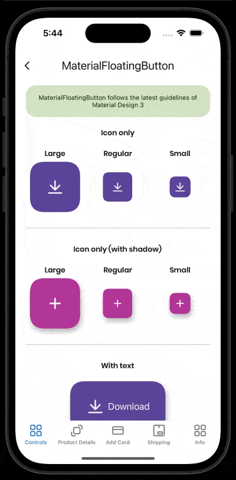

# MaterialFloatingButton
This control is a custom implementation of a floating action button. You can customize some properties that we show in Documentation topic. 
<br/>
[View Material Design documentation](https://m3.material.io/components/floating-action-button/overview)

## Screenshot


## Example
```XML
 <material3:MaterialFloatingButton
    Icon="add_b.png"
    Command="{Binding TapCommand}" />
```
<br/>

## Documentation
<br/>

### Property ShadowColor:
This property is to set the shadow color.
<br/>
<br/>

### Property Icon:
This property is to set the icon of the button with .png files.
<br/>
<br/>

### Property DisabledIcon:
This property is to set the icon of the button when .png files when the property IsEnabled is False.
<br/>
<br/>

### Property CustomIcon:
This property is to set the icon of the button with .svg files.
<br/>
<br/>

### Property DisabledIcon:
This property is to set the icon of the button when .svg files when the property IsEnabled is False.
<br/>
<br/>

### Property IconHeightRequest:
This property is to set the HeightRequest of the icon.
<br/>
<br/>

### Property IconWidthRequest:
This property is to set the WidthRequest of the icon.
<br/>
<br/>

### Property BackgroundColor:
This property is to set the color of the button.
<br/>
<br/>

### Property DisabledBackgroundColor:
This property is to set the color of the button when property IsEnabled is False.
<br/>
<br/>

### Property Animation:
This property is to set the button's animation. It could be: None, Fade or Scale.
<br/>
<br/>

### Property FontSize:
This property is to set the fontsize of the text.
<br/>
<br/>

### Property FontFamily:
This property is to set the fontfamily of the text.
<br/>
<br/>

### Property FontAttributes:
This property is to set the fontattributes of the text.
<br/>
<br/>

### Property Type:
This property is to set the type of button. It coulb be: Regular, Large or Small. By default is Regular.
<br/>
<br/>

### Property Text:
This property is to set the text of the button. This only appears when ButtonSize is Large.
<br/>
<br/>

### Property TextColor:
This property is to set the color of the text.
<br/>
<br/>

### Property DisabledTextColor:
This property is to set the color of the text when the property IsEnabled is False.
<br/>
<br/>

### Property ToUpper:
This property is to convert text to uppercase.
<br/>
<br/>

### Property IconSide:
This property is to set if the icon will be in the right or left side. This only applies when ButtonSize is Large.
<br/>
<br/>

### Property CornerRadius:
This property is to set corner radius of the button.
<br/>
<br/>

### Property HasShadow 
This property is to set if the button will have shadow or not.
<br/>
<br/>

### Property HeightRequest
This property is to set HeightRequest of the button.
<br/>
<br/>

### Property WidthRequest
This property is to set WidthRequest of the button.
<br/>
<br/>

### Property Padding
This property is to set Padding of the button.
<br/>
<br/>

### Property Clicked
This property is to add a event when button is clicked.
<br/>
<br/>

### Property Command
This property is to bind on the viewmodel.
<br/>
<br/>

### Property CommandParameter
This property is to set the parameter of the Command property.
