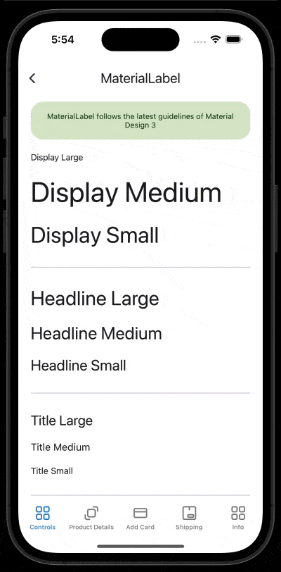

# MaterialLabel
Labels help make writing legible and beautiful.
<br/>
[View Material Design documentation](https://m3.material.io/styles/typography/overview)

## Screenshot


## Example
```XML
<material3:MaterialLabel
    Type="DisplayLarge"
    Text="Display Large" />

<material3:MaterialLabel
    Type="DisplayMedium"
    Text="Display Medium" />
```

## Documentation
This control inherits from the Label control, so it inherits all the properties of that control.
<br/>

### Property Type
This property sets the label type, automatically handling the label aspect (FontFamily, CharacterSpacing and FontSize).
<br/>
<br/>

### Property FontFamilyRegular
This property is to set the regular font family that will be used automatically by the Type property.
<br/>
<br/>

### Property FontFamilyMedium
This property is to set the medium font family that will be used automatically by the Type property.
<br/>
<br/>