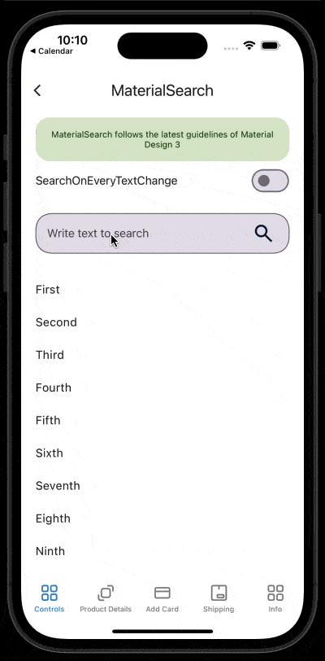

# MaterialSearch
MaterialSearch receives a text and executes a search action.
<br/>
[View Material Design documentation](https://m3.material.io/components/search/overview)

## Screenshot



## Example
```XML
<material3:MaterialSearch
    Text="{Binding TextSearch}"
    SearchCommand="{Binding SearchCommand}"
    SearchOnEveryTextChange="True"
    Placeholder="Write text to search" />
```

## Documentation

### Property Text:
This property is to set the search text<br/>

### Property SearchOnEveryTextChange:
This property determines whether the search will be triggered by the keyboard action button (false) or if it will occur each time a character is typed (true).<br/>

### Property SearchCommand:
This property is to set the command that will execute the search. It sends a string parameter with the Text property value to perform the search.
<br/>

### Property CornerRadius:
This property is to set the corner radius for the control. This is used only when you set HasBorder as true.

CornerRadius supports a uniform radius to the four corners or you can set a different corner radius for each corner:
- CornerRadius="10"
- CornerRadius="0,10,10,10"
<br/>
<br/>

### Property AnimateError:
This property is to set the if you want or not animate the control on error.
<br/>
<br/>

### Property HorizontalTextAlignment:
This property is to set the horizontal text alignment.
#### Allowed Values:
- Start
- Center
- End
<br/>
<br/>

### Property TextColor:
This property is to set the text color.
<br/>
<br/>

### Property FocusedTextColor:
This property is to set the focused text color.
<br/>
<br/>

### Property DisabledTextColor:
This property is to set the disabled text color.
<br/>
<br/>

### Property FontSize:
This property is to set the font size.
<br/>
<br/>

### Property FontFamily:
This property is to set the font family.
<br/>
<br/> 

### Property Placeholder:
This property is to set the placeholder of the material entry.
<br/>
<br/>

### Property PlaceholderColor:
This property is to set the placeholder color of the material entry.
<br/>
<br/>

### Property AnimatePlaceholder:
If you set this property to true the placeholder will be translated to label place. **you mustn't set Label Text**
<br/>
<br/>

### Property LabelText:
This property is to set the label of the material entry.
<br/>
<br/>

### Property LabelTextColor:
This property is to set the label color of the material entry.
<br/>
<br/>

### Property FocusedLabelTextColor:
This property is to set the focused label color.
<br/>
<br/>

### Property DisabledLabelTextColor:
This property is to set the disabled label color.
<br/>
<br/>

### Property LabelSize:
This property is to set the label size of the material entry.
<br/>
<br/>

### Property LabelFontFamily:
This property is to set the label font family of the material entry.
<br/>
<br/>

### Property LabelMargin:
This property is to set the label margin family of the material entry. By default uses (16,0,16,0).
<br/>
<br/>

### Property SupportingText:
This property is to set the supporting text of the material entry.
<br/>
<br/>

### Property SupportingTextColor:
This property is to set the supporting text color of the material entry.
<br/>
<br/>

### Property SupportingSize:
This property is to set the supporting text size of the material entry.
<br/>
<br/>

### Property SupportingFontFamily:
This property is to set the supporting text font family of the material entry.
<br/>
<br/>

### Property SupportingMargin:
This property is to set the supporting text margin of the material entry. By default uses (16,4,16,0).
<br/>
<br/>

### Property BorderColor:
This property is to set the border color. This is enabled when you set the property HasBorder equals true.
<br/>
<br/>

### Property FocusedBorderColor:
This property is to set the focused border color. This is enabled when you set the property HasBorder equals true.
<br/>
<br/>

### Property DisabledBorderColor:
This property is to set the border color. This is enabled when you set the property HasBorder equals true.
<br/>
<br/>

### Property HasBorder:
This property is to set if this control has border or not.
<br/>
<br/>

### Property BorderWidth:
This property is to set the border width.
<br/>
<br/>

### Property IndicatorColor:
This property is to set the indicator color.
<br/>
<br/>

### Property BackgroundColor:
This property is to set the background color.
<br/>
<br/>

### Property LeadingIcon:
This property is to set the leading icon. This can be png or jpg.
<br/>
<br/>

### Property CustomLeadingIcon:
This property is to set the leading icon with support to svg.
<br/>
<br/>

### Property LeadingIconCommand:
This property is to set the leading icon command.
<br/>
<br/>

### Property LeadingIconCommandParameter:
This property is to set the leading icon command parameter.
<br/>
<br/>

### Property TrailingIcon:
This property is to set the trailing icon. This can be png or jpg.
<br/>
<br/>

### Property CustomTrailingIcon:
This property is to set the trailing icon with support to svg.
<br/>
<br/>

### Property TrailingIconCommand:
This property is to set the trailing icon command.
<br/>
<br/>

### Property TrailingIconCommandParameter:
This property is to set the trailing icon command parameter.
<br/>
<br/>

### Property LabelLineBreakMode:
This property is to set the Label Line Break Mode
#### Allowed values
- NoWrap,
- WordWrap,
- CharacterWrap,
- HeadTruncation,
- TailTruncation,
- MiddleTruncation
<br/>
<br/>

### Property SupportingLineBreakMode:
This property is to set the Supporting LineBreakMode.
#### Allowed values
- NoWrap,
- WordWrap,
- CharacterWrap,
- HeadTruncation,
- TailTruncation,
- MiddleTruncation
<br/>
<br/>

### Property Padding:
This property is to set the padding of the control. By default uses (16, 8).
<br/>
<br/>