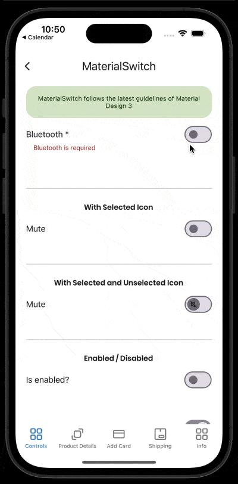

# MaterialSwitch
Switches toggle the state of a single item on or off.
<br/>
[View Material Design documentation](https://m3.material.io/components/switch/overview)

## Screenshot


## Example
```XML
 <material3:MaterialSwitch   
    Text="Bluetooth *"
    IsToggled="False"
    TextColor="#0d1a26"
    SupportingTextColor="Red"
    SupportingText="Bluetooth is required"/>
```
<br/>

## Documentation
<br/>

### Property BackgroundOnUnselectedColor:
This property is to set the background color when the switch toggled is false.
<br/>
<br/>

### Property DisabledBackgroundOnUnselectedColor:
This property is to set the disabled background color when the switch toggled is false.
<br/>
<br/>

### Property BackgroundOnSelectedColor:
This property is to set the background color when the switch toggled is true.
<br/>
<br/>

### Property DisabledBackgroundOnSelectedColor:
This property is to set the disabled background color when the switch toggled is true.
<br/>
<br/>

### Property BorderWidth:
This property is to set the border width. Default value is 2.
<br/>
<br/>

### Property BorderOnUnselectedColor:
This property is to set the border color when the switch toggled is false.
<br/>
<br/>

### Property DisabledBorderOnUnselectedColor:
This property is to set the disabled border color when the switch toggled is false.
<br/>
<br/>

### Property BorderOnSelectedColor:
This property is to set the border color when the switch toggled is true.
<br/>
<br/>

### Property DisabledBorderOnSelectedColor:
This property is to set the disabled border color when the switch toggled is true.
<br/>
<br/>

### Property IsToggled:
This property is to set if the control is toggled or not. By default is False.
<br/>
<br/>

### Property ToggledCommand:
This property is to set a command when the switch is toggled.
<br/>
<br/>

### Property ThumbUnselectedColor:
This property is to set the thumb color when the switch toggled is false.
<br/>
<br/>

### Property DisabledThumbUnselectedColor:
This property is to set the disabled thumb color when the switch toggled is false.
<br/>
<br/>

### Property ThumbSelectedColor:
This property is to set the thumb color when the switch toggled is true.
<br/>
<br/>

### Property DisabledThumbSelectedColor:
This property is to set the disabled thumb color when the switch toggled is true.
<br/>
<br/>

### Property SelectedIcon:
This property is to set the thumb icon when the switch toggled is true.
<br/>
<br/>

### Property CustomSelectedIcon:
This property is to set the thumb icon (SVG) when the switch toggled is true.
<br/>
<br/>

### Property UnselectedIcon:
This property is to set the thumb icon when the switch toggled is false. **To show this icon, you must set SelectedIcon**
<br/>
<br/>

### Property CustomUnselectedIcon:
This property is to set the thumb icon (SVG) when the switch toggled is false.
<br/>
<br/>

### Property Text:
This property is to set the text value.
<br/>
<br/>

### Property TextColor:
This property is to set the color of the text when the control is enabled.
<br/>
<br/>

### Property DisabledTextColor:
This property is to set the color of the text when the control is disabled.
<br/>
<br/>

### Property FontSize:
This property is to set the font size of the text.
<br/>
<br/>

### Property FontFamily:
This propperty is to set the font family of the text.
<br/>
<br/>

### Property SupportingText:
This property is to set the error text on the control. 
<br/>
<br/>

### Property SupportingTextColor:
This property is to set the error text color value on the control.
<br/>
<br/>

### Property SupportingSize:
This property is to set the error text font size value on the control. 
<br/>
<br/>

### Property SupportingFontFamily:
This property is to set the error text font family value on the control.
<br/>
<br/>

### Property SupportingMargin:
This property is to set the error text margin value on the control.
<br/>
<br/>

### Property AnimateError:
This property is to set if you can show a ShakeAnimation when there is a error with control.
<br/>
<br/>

### Property TextSide:
This property is to set the side of the text, it could be: Right or Left. By default is Right.
<br/>
<br/>

### Property TextVerticalOptions:
This property is to set the VerticalOptions of the text. By default is End.
<br/>
<br/>

### Property TextHorizontalOptions:
This property is to set the HorizontalOptions of the text. By default is Start.
<br/>
<br/>

### Property SwitchHorizontalOptions:
This property is to set the HorizonatlOptions of the switch. By default is start.
<br/>
<br/>

### Property Spacing:
This property is to set the space between switch and text. By default is 10.
<br/>
<br/>

### Property IsEnabled:
This property is to set if the control is enabled or not. By default is True.
<br/>
<br/>
