# MaterialDesignControls Plugin for Xamarin Forms


MaterialDesignControls Plugin for Xamarin.Forms, provides a collection of Xamarin.Forms controls that follow the [Material Design 3 Guidelines](https://m3.material.io/design/components/selection-controls.html).


## Coming soon
[.NET MAUI](https://learn.microsoft.com/en-us/dotnet/maui/what-is-maui)            
We're developing the next version of the plugin for .NET MAUI, bringing you exciting features and improvements.    

## Demo


## Content table
- [Setup](#setup)
- [API Usage](#api-usage)
- [Styles](#styles)
- [Controls](#controls)
  - [MaterialButton](#materialbutton)
  - [MaterialChips \& MaterialChipsGroup](#materialchips--materialchipsgroup)
  - [MaterialDatePicker](#materialdatepicker)
  - [MaterialEditor](#materialeditor)
  - [MaterialEntry](#materialentry)
  - [MaterialCodeEntry](#materialcodeentry)
  - [MaterialField](#materialfield)
  - [MaterialPicker](#materialpicker)
  - [MaterialDoublePicker](#materialdoublepicker)
  - [MaterialSelection](#materialselection)
  - [MaterialTimePicker](#materialtimepicker)
  - [MaterialRating](#materialrating)
  - [MaterialSlider](#materialslider)
  - [MaterialSegmented](#materialsegmented)
  - [MaterialDivider](#materialdivider)
  - [MaterialRadioButtons](#materialradiobuttons)
  - [MaterialFloatingButton](#materialfloatingbutton)
  - [MaterialCheckbox](#materialcheckbox)
  - [MaterialSwitch](#materialswitch)
  - [MaterialTopAppBar](#materialtopappbar)
  - [MaterialProgressIndicator](#materialprogressindicator)
  - [MaterialLabel](#materiallabel)
  - [MaterialBadge](#materialbadge)
  - [MaterialNavigationDrawer](#materialnavigationdrawer)
  - [MaterialCustomControl](#materialcustomcontrol)
  - [MaterialSearch](#materialsearch)
  - [MaterialIconButton](#materialiconbutton)
  - [MaterialSnackBar](#materialsnackbar)
  - [MaterialDialog](#materialdialog)
  - [MaterialCard](#materialcard)
- [Effects](#effects)
  - [TouchAndPressEffect](#touchandpresseffect)
- [Sample app](#sample-app)
- [Developed by](#developed-by)
- [Contributions](#contributions)
- [License](#license)


## Setup
* Available on NuGet: [Plugin.MaterialDesignControls](https://www.nuget.org/packages/Plugin.MaterialDesignControls/) [](https://www.nuget.org/packages/Plugin.MaterialDesignControls/)
* Install into your PCL project and Client projects.

**Platform Support**

|Platform|Version|
| ------------------- | :------------------: |
|Xamarin.iOS|iOS 8+|
|Xamarin.Android|API 16+|
|Xamarin.Forms|>= 5.0.0.1874|

## API Usage

You must add this line to your platform specific project (`AppDelegate.cs`, `MainActivity.cs`) before you use MaterialDesignControls:

if you're using **iOS**:
```C#
Plugin.MaterialDesignControls.iOS.Renderer.Init();           
```

or if you're using **Android**:
```C#
Plugin.MaterialDesignControls.Android.Renderer.Init();           
```
You must add this namespace to your xaml files **(deprecated)**:

```XML
xmlns:material="clr-namespace:Plugin.MaterialDesignControls;assembly=Plugin.MaterialDesignControls"
```

**You must add this namespace to your xaml files to use Material Design 3 controls:**

```XML
xmlns:material="clr-namespace:Plugin.MaterialDesignControls.Material3;assembly=Plugin.MaterialDesignControls"
```

## Styles
You can override colors, font sizes, font families and animations to apply to all the Material controls.
<br/>
[View documentation](Styles.md)

## Controls

### MaterialButton
Buttons allow users to take actions, and make choices, with a single tap.
<br/>

<br/>
[View documentation](MaterialButtonControl.md)

---

### MaterialChips & MaterialChipsGroup
Chips are compact elements that represent an input, attribute, or action.
<br/>
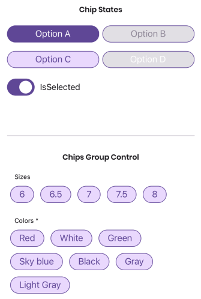
<br/>
[View MaterialChips documentation](MaterialChipsControl.md)
<br/>
[View MaterialChipsGroup documentation](MaterialChipsGroup.md)

---

### MaterialDatePicker
Date pickers let users select a date.
<br/>

<br/>
[View documentation](MaterialDatePickerControl.md)

---

### MaterialEditor
Text fields let users enter and edit text.
<br/>

<br/>
[View documentation](MaterialEditorControl.md)

---

### MaterialEntry
Text fields let users enter and edit text.
<br/>
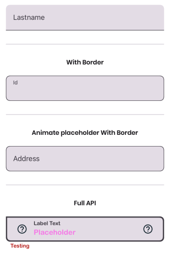
<br/>
[View documentation](MaterialEntryControl.md)

---

### MaterialCodeEntry
Code fields let users enter and edit pin codes.
<br/>

<br/>
[View documentation](MaterialCodeEntryControl.md)

---

### MaterialField
Displays a value with its respective label in read-only format.
<br/>

<br/>
[View documentation](MaterialFieldControl.md)

---

### MaterialPicker
Pickers let users select an option.
<br/>

<br/>
[View documentation](MaterialPickerControl.md)

---

### MaterialDoublePicker
Double pickers let users select two options in the same dialog.
<br/>

<br/>
[View documentation](MaterialDoublePickerControl.md)

---

### MaterialSelection
Selection let users select an option.
<br/>
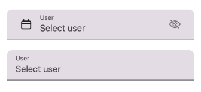
<br/>
[View documentation](MaterialSelectionControl.md)

---

### MaterialTimePicker
Time pickers let users select a time.
<br/>

<br/>
[View documentation](MaterialTimePickerControl.md)

---

### MaterialRating
Displays a rating control
<br/>
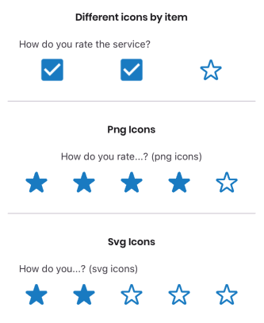
<br/>
[View documentation](MaterialRatingControl.md)

---

### MaterialSlider
Displays a slider control
<br/>

<br/>
[View documentation](MaterialSliderControl.md)

---

### MaterialSegmented
Displays a segmented control
<br/>
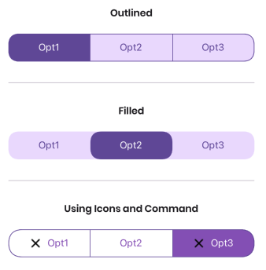
<br/>
[View documentation](MaterialSegmentedControl.md)

---

### MaterialDivider
A divider is a thin line that groups content in lists and layouts.
<br/>
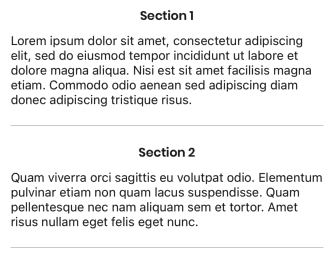
<br/>
[View documentation](MaterialDividerControl.md)

---

### MaterialRadioButtons
Displays a radiobuttons control
<br/>
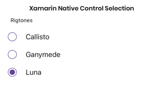
<br/>
[View documentation](MaterialRadioButtonsControl.md)

---

### MaterialFloatingButton
Displays a floating button
<br/>

<br/>
[View documentation](MaterialFloatingButton.md)

---

### MaterialCheckbox
Displays a checkbox control
<br/>

<br/>
[View documentation](MaterialCheckboxControl.md)

---

### MaterialSwitch
Switches toggle the state of a single item on or off.
<br/>
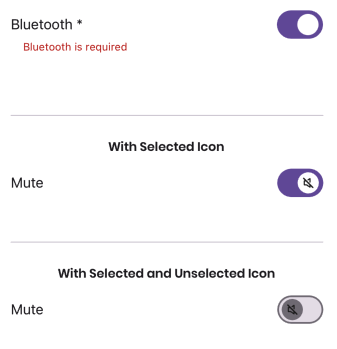
<br/>
[View documentation](MaterialSwitchControl.md)

---

### MaterialTopAppBar
TopAppBar displays information and actions at the top of a screen.
<br/>

<br/>
[View documentation](MaterialTopAppBar.md)

---

### MaterialProgressIndicator
MaterialProgressIndicator show the status of a process in real time
<br/>

<br/>
[View documentation](MaterialProgressIndicator.md)

---

### MaterialLabel
MaterialLabel helps make writing legible and beautiful
<br/>
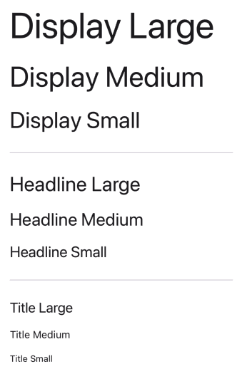
<br/>
[View documentation](MaterialLabelControl.md)

---

### MaterialBadge
Badges show notifications, counts, or status information on navigation items and icons
<br/>
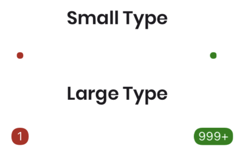
<br/>
[View documentation](MaterialBadgeControl.md)

---

### MaterialNavigationDrawer
Navigation drawers let people switch between UI views on larger devices
<br/>

<br/>
[View documentation](MaterialNavigationDrawerControl.md)

---

### MaterialCustomControl
This control provides a simple way to create custom controls with labels and support text that follow the Material Design Guidelines.
<br/>

<br/>
[View documentation](MaterialCustomControl.md)

---

### MaterialSearch
MaterialSearch receives a text and executes a search action.
<br/>

<br/>
[View documentation](MaterialSearch.md)

---

### MaterialIconButton
MaterialIconButton displays an icon and can execute a command.
<br/>

<br/>
[View documentation](MaterialIconButton.md)

---

### MaterialSnackBar
MaterialSnackBar show short updates about app processes at the bottom of the screen.
<br/>
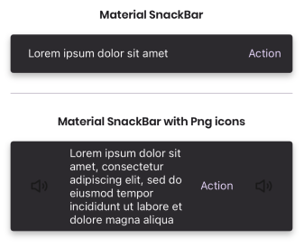
<br/>
[View documentation](MaterialSnackBar.md)

---

### MaterialDialog
MaterialDialog provide important prompts in a user flow.
<br/>

<br/>
[View documentation](MaterialDialog.md)

---

### MaterialCard
MaterialCard display content and actions about a single subject.
<br/>

<br/>
[View documentation](MaterialCard.md)

---

<br/>

## Effects

### TouchAndPressEffect
Effect to detect the different types of taps on a view: Pressing, Released and Canceled can be detected.

**Example**
```XML
<MyControl.Effects>
    <material:TouchAndPressEffect />
</MyControl.Effects>
```

```C#
public class MyControl : ContentView, ITouchAndPressEffectConsumer
{
    public void ConsumeEvent(EventType gestureType)
    {
        TouchAndPressAnimation.Animate(this, gestureType);
    }
}
```


## Sample app
https://github.com/HorusSoftwareUY/MaterialDesignControlsPlugin/tree/master/example


## Developed by
<a href="http://horus.com.uy" ></a>


## Contributions
Contributions are welcome! If you find a bug want a feature added please report it.

If you want to contribute code please file an issue, create a branch, and file a pull request.


## License 
MIT License - see LICENSE.txt
